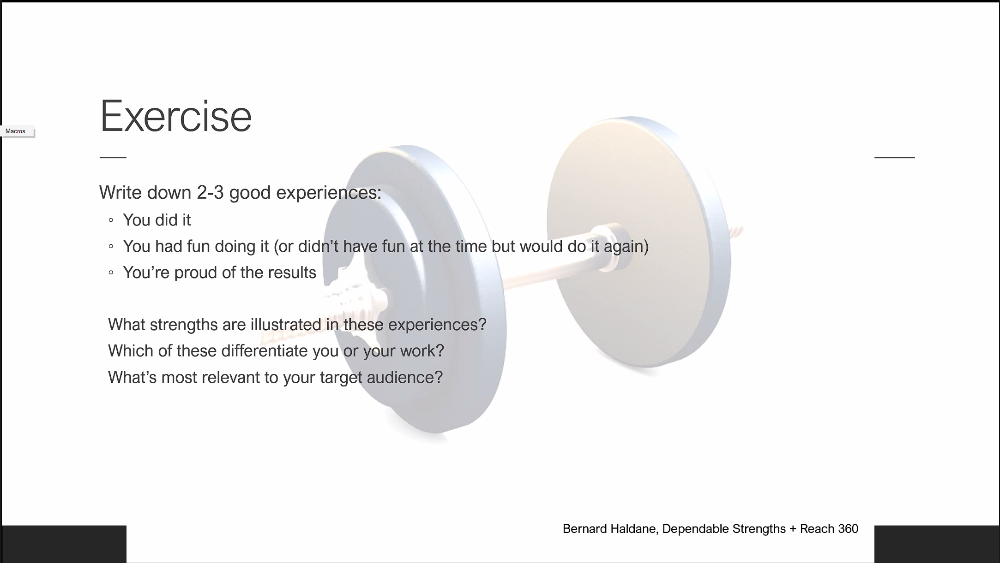

# February 24, 2022

I decided that I need to start making contemporaneous notes, so that I can refer
back to things and better understand the evolution.  I don't expect this will be
generally useful, but it helps me capture my own "activity context."

At present, I have the data collection from the NTFS USN journal working.  I
have a MongoDB set up inside a container.  I can _talk_ to the MongoDB
successfully.  What I have been puzzling over is what to put in the MongoDB and
how to format it.  Part of what I have been doing to process this is going back
through Vianna's work.  She does actually point to a number of useful
issues/observations that I have been mulling over:

* There is an issue around the format of the data itself.  As Vianna points out,
  the very structure of the information is quite fluid, changing as needed.
  This makes it more challenging to extract information, since there is no
  canonical format.  Indeed, even a single data source may change the format of
  the information over time.

* Information in "raw" format is not actually terribly useful by itself.
  However, capturing that data allows us to mine it at a later time.  Thus, I
  think her approach of saving the raw data makes sense.

(I'm sure there are more, but I didn't capture them after I was working through
that material.  One reason for trying to keep contemporaneous notes.)

Thus, I've adopted the idea of a "transducer" (interestingly enough Google's
BERT uses the same term) along the lines of Gifford's SFS work.  In this
instance, it is not identical: Gifford's transducers extract semantic content
from the file and use that for indexing.  I have a broader interpretation of
this.  While a transducer could perform the semantic extraction of Gifford, I
also envision it as performing extraction of useful information from the
meta-data.  It occurs to me that we could have transducers that work fairly
independently:

* Classifiers - these can scan certain types of files and try to identify
  specific characteristics/features (in the ML or CV sense).

* Extractor - this is more like Gifford's transducers, extracting information
  from the given object.

* Identifier - it occurs to me that computing the checksum of a file could be
  useful.  It provides specific identity and can be used to determine versions
  (for example).

With this model of transducers, I want to permit multiple distinct transducers
to operate on the given data.  Thus, I need to have some way of identifying the
transducer.  Since there is always going to be a versioning issue, I would
suggest that, at a minimum, the output of the transducer should identify which
transducer generated it, what version, and when.

Thus, we have activity records.  One example of this is a file event, but other
types of activity could include meetings (e.g., from someone's calendar,)
purchases (from someone's credit card and/or web activity,) or pretty much any
of the things that Vianna suggested capturing.

An activity record then consists of a unique identifier for the activity event,
a timestamp, and raw data.  It may also contain distinct attributes created by
the transducer: (attribute, (transducer, version), timestamp, value).  Thus,
transducers can augment the attribute information over time. This fits nicely
with how MongoDB works (at least my _perception_ of how it works) and allows me
to collect data without really knowing exactly what I want to know about it at
the time the data is collected.  It also helps me iteratively build up that
information.

## Event

If I envision this as JSON data, an Event looks something like:

```json
{
    "Source" : {
        "Identifier" : "<GUID>",
        "Version" : 1
    },
    "Time" : "Timestamp",
    "Data" : "Arbitrary data of some sort, including nested structure",
    "Attributes" : {}
}
```

Thus, the attributes are where transducers would add information they extract or
add to the given event.  I can then define specific attributes _and their
meaning_ without preventing extensibility (e.g., adding new/additional
attributes.)

## USN Journal

The first thing I've been collecting are file events extracted from the NTFS USN
journal (basically an activity log).  That is an example where the data
collector might also be a transducer.

```json
{
    "Record" : "4bed460f-2a17-4ca0-8f8f-874e24a49cf2",
    "Source" : {
        "Identifier" : "84635987-5a15-48c1-95e7-64651d4923cd",
        "Version" : "4.0"
    }
}
```

Do I need to record the USN journal information? If so, it would look something
like this:

```json
{
    "Record" : "ceac9ff6-c78c-4648-8901-e644d2ac1127",
    "Source" : {
        "Identifier" : "e1331000-1bfc-4e03-a4de-de66ee3333ab",
        "Version" : "4.0"
    },
    "Data" : {
        "Journal" : {
            "USN Journal ID" : "0x01d6a0c52c1b9016",
            "First Usn" : "0x0000000c02800000",
            "Next Usn" : "0x0000000c04d18550",
            "Lowest Valid Usn" : "0x0000000000000000",
            "Max Usn" : "0x00000fffffff0000",
            "Maximum Size" : "0x0000000002000000",
            "Allocation Delta" : "0x0000000000800000",
            "Minimum record version supported" : 2,
            "Maximum record version supported" : 4,
            "Write Range Tracking" : false

    }
}
```

Having such a record would allow me to then reference it.

**Question: should I have something to identify the system from which this data
is drawn?  That's not a big deal for single system, but for multi-system it
might be.**

Bottom line: I can collect data just by storing information that I collect and
then building transducers on top of that.  Above I was arguing for a more
complex representation of data, but that's about efficiency more than anything
else.


## UUIDs

I generated some UUIDs (from [UUID Generator](https://www.uuidgenerator.net/))
from which to draw:

```text
e52076f6-8853-4569-a74d-6a411e0665eb
8d33090c-0fe3-4ae6-9ddb-bfd48a1a6bf3
82528595-c863-4904-b333-81a0255a7d29
d80a4170-7da5-4bb2-acff-a6aa7bff6910
f6acc130-6d0c-48b4-bce8-d550d519a69c
9abdc769-aec1-42cb-94af-147f89a8529e
52951f39-37d0-47ed-afc0-322495bc01ec
12a9703c-ffb9-4aa3-b1bc-d0fff1068a02
4d8e25f3-6016-4d4f-aeab-48b888971998
bd07ff42-bf05-4857-b74d-fe2038d73bd4
c2c02823-95b3-465b-a8b8-e678d18c02cd
65e4e024-5d45-4061-a2e9-e33ddd73dad7
ce6d9e1e-56df-4f9f-ab87-4cba5dc6a50d
01178c0e-5f61-4060-82eb-2dda6a52ea2e
a9b05a72-b06c-4c4d-9340-5ce59b0244fd
c5c49657-e731-431b-ab4e-742271576b81
```

## Workshop

This was a departmentally sponsored workshop.  It was _interesting_ yet it felt
very superficial.

### Question (Exercise)

Write down 2-3 good experiences:

* You did it
* You had fun doing it (or didn't have fun at the time but would do it again)
* You're proud of the results

What strengths are illustrated in these experiences?
Which of these differentiate you or your work?
What's most relevant to your target audience?

### Answer

In general, I take pride in producing things that are _useful_:

* The software development work that I did in the past that is still in
  production use.  It demonstrated a novel (at the time) approach to a problem
  that distinguished itself from other prior work, functioned quite well, and is
  still in production use today.

* Making sourdough bread is something that became a fad during the early Covid
  pandemic.  I had been doing it for many years at that point, and I shared my
  experiences with other people.  For whatever reason, I found many people had a
  difficult time with it and I was glad I could help them succeed.  In addition,
  I have been able to build upon my own skills so that I can now make beautiful
  loaves with my own recipe, including my own flours that I mill from whole grain.

* I have written two technical books, both of which are still in use today.
  Writing a book is a huge undertaking.  I am not sure that I would do so again,
  but I am proud of my work and knowing that they have helped many people.

Strengths: contribution of useful work, helping others be more successful.

Differentiation: I was able to do things many others found
difficult/intimidating and help them gain skills.

Relevant to target audience: Ability to enable others to succeed.

When I taught debugging, I would ask students to bring in crash dumps (memory
images of the machine in a crashed state) and walk through them with students
watching (and I would record a log).  This seemed to help them understand that
the skills I had been teaching them were _real_ and not simply canned based upon
looking through the material that I presented to them.  I would receive great
feedback from some students later about how the skills they gained were quite
useful.


